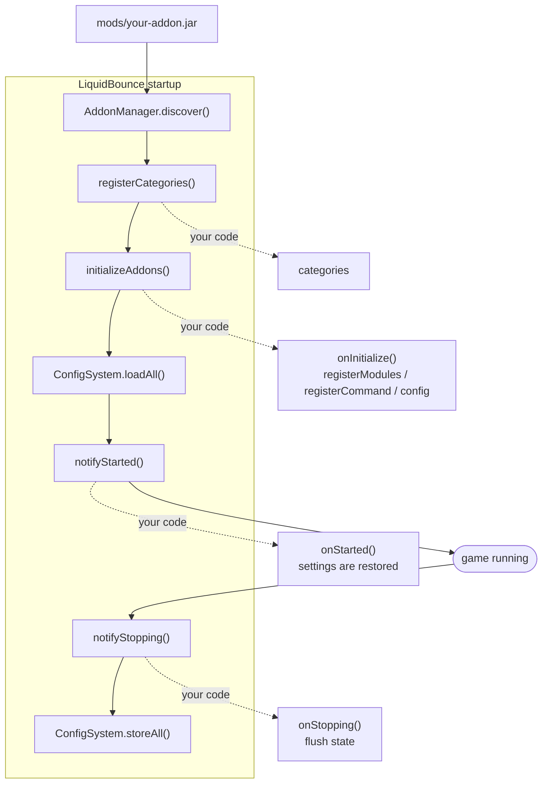

# LiquidBounce Add-on Template

A starting point for a [LiquidBounce](https://github.com/CCBlueX/LiquidBounce) add-on.



## Requirements

- JDK 25
- A LiquidBounce build to compile against (a published snapshot, or one you built yourself)

## Getting started

1. Click **Use this template** on GitHub, or `git clone --depth 1` this repository.
2. Rename things away from the example. There are eight places:

   | File | What to change |
   |---|---|
   | `settings.gradle.kts` | `rootProject.name` |
   | `gradle.properties` | `maven_group`, `archives_base_name` |
   | `src/main/resources/fabric.mod.json` | `id`, `name`, `description`, `authors`, the entrypoint class |
   | `src/main/resources/example-addon.mixins.json` | filename, and the `package` |
   | `src/main/resources/example-addon.accesswidener` | filename (and `loom.accessWidenerPath` in `build.gradle.kts`) |
   | `src/main/resources/resources/example-addon/` | folder name, which must match your add-on id, and the `icon` path |
   | `src/main/kotlin/com/example/addon/` | package name |

3. `./gradlew build`, then drop `build/libs/<your-addon>.jar` into your `mods/` folder next to
   LiquidBounce.
4. In game, `.addon list` should show it, and `.example` should answer.

## Targeting a LiquidBounce version

`gradle/libs.versions.toml`:

```toml
liquidbounce = "0.40.1+26.2-SNAPSHOT"
```

- `<version>+<mc>` for a release, from `maven.ccbluex.net/releases`
- `<version>+<mc>-SNAPSHOT` for the moving nextgen build, from `maven.ccbluex.net/snapshots`
- `<version>+<mc>-<sha>-SNAPSHOT` to pin one commit

To build against a local client, run `./gradlew publishToMavenLocal` in a LiquidBounce checkout;
`mavenLocal()` is already in this template's repositories.

**Do not add a `mappings(...)` line.** LiquidBounce declares none either, and Loom defaults to
Mojang official mappings for this Minecraft version. A different mapping set produces an add-on that
compiles and then fails on every Minecraft call.

## What the example covers

- `ExampleAddon`, the entrypoint and its lifecycle hooks
- `ExampleCategories`, a custom ClickGUI category
- `modules/ModuleExample`, a `ClientModule` with settings and a tick handler
- `commands/CommandExample`, a Brigadier command
- `mixin/MixinExampleTitleScreen`, a Mixin into a vanilla class
- `resources/example-addon/lang/en_us.json`, translations merged into the client's language files

Client translation keys always win on collision, so an add-on cannot redefine a built-in string.

## Files your add-on ships

Everything goes into `src/main/resources/resources/<your-addon-id>/`: translations under `lang/`, the mod
icon, ClickGUI category icons (`ModuleCategory("Name", Identifier.fromNamespaceAndPath("<your-addon-id>", "clickgui/name.svg"))`).
Never use `assets/<your-addon-id>/`. Fabric registers every mod jar as a resource pack, so anything under
`assets/` becomes part of Minecraft's resources and could theoretically be used to detect LiquidBounce and
the add-on. The client reads its own `resources/` folder from the jar directly, which nothing else sees.

Everything marked `@AddonApi` in the client is stable between releases; the rest may change. For a
larger example, Kotlin and Java side by side and game tested, see
[LiquidBounce-Addon-Extras](https://github.com/CCBlueX/LiquidBounce-Addon-Extras).

## Publishing

A GitHub release pushes the jar to the LiquidBounce Marketplace. Create the add-on and an API token at
[liquidbounce.net/account/resources](https://liquidbounce.net/account/resources), then set both on the
repository under Settings, Secrets and variables, Actions:

| Kind     | Name                  | Value                              |
|----------|-----------------------|------------------------------------|
| Variable | `MARKETPLACE_ITEM_ID` | the ID shown next to your add-on   |
| Secret   | `API_TOKEN`           | the token, it is only shown once   |

The release tag becomes the version and the release notes become the changelog, so keep the tag in line
with `mod_version`. Pre-releases are skipped. Uploads wait for review before clients see them, unless
the account is a trusted publisher.

## License

This project is subject to the [GNU General Public License v3.0](https://www.gnu.org/licenses/gpl-3.0.en.html). This
does only apply for source code located directly in this clean repository. During the development and compilation
process, additional source code may be used to which we have obtained no rights. Such code is not covered by the GPL
license.

For those who are unfamiliar with the license, here is a summary of its main points. This is by no means legal advice
nor legally binding.

*Actions that you are allowed to do:*

- Use
- Share
- Modify

*If you do decide to use ANY code from the source:*

- **You must disclose the source code of your modified work and the source code you took from this project. This means
  you are not allowed to use code from this project (even partially) in a closed-source (or even obfuscated)
  application.**
- **Your modified application must also be licensed under the GPL**
